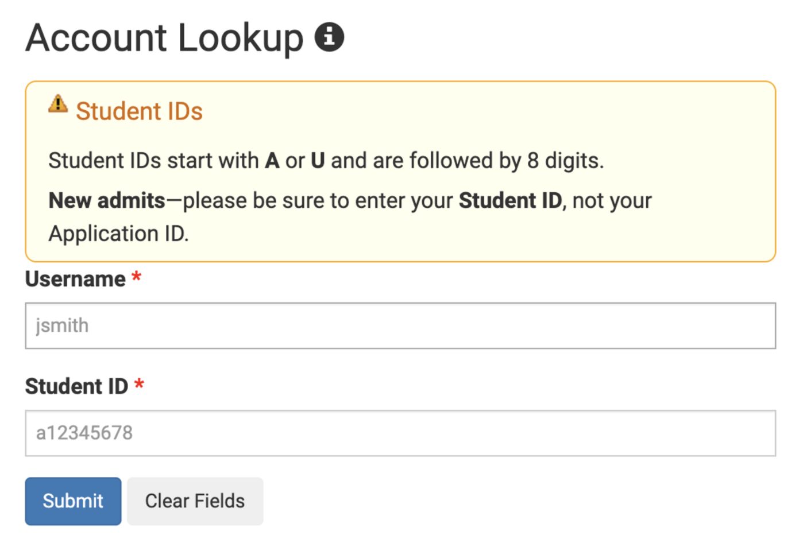
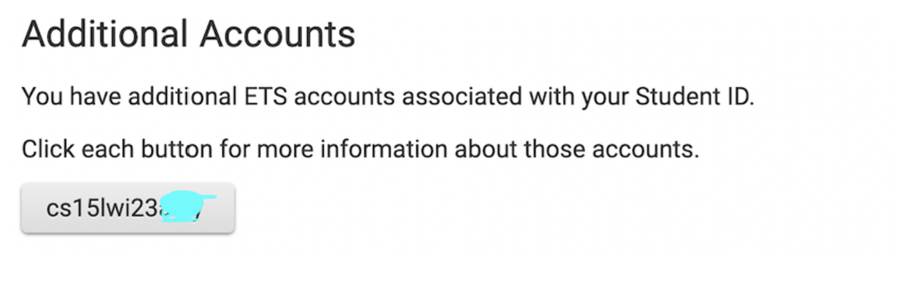
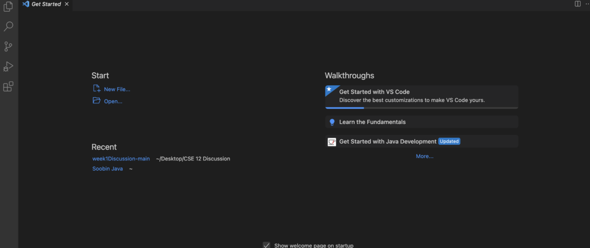
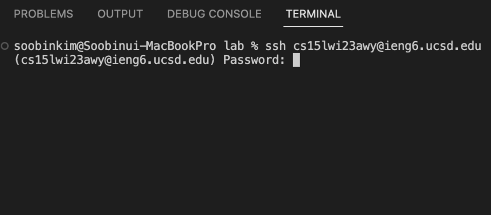
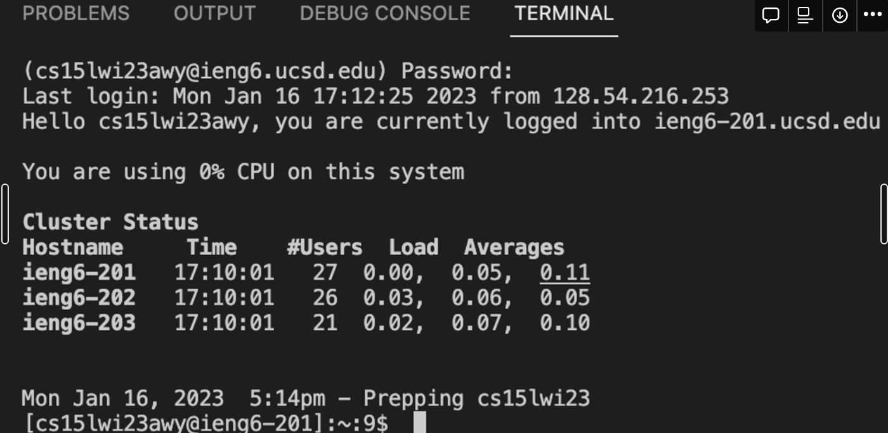
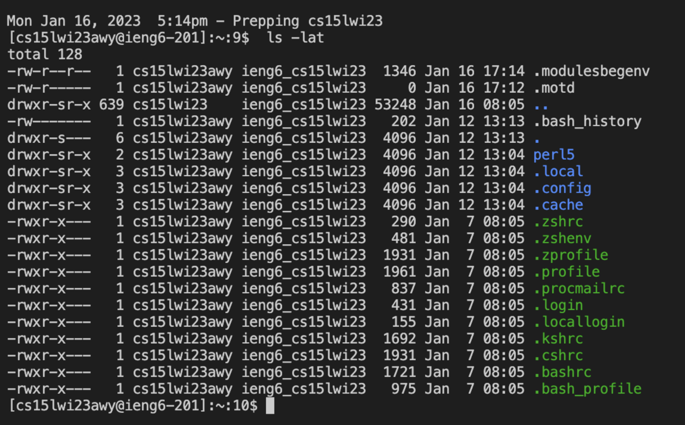

# Lab Report 1

### Part 1 - Course On Boarding

Welcome to CSE 15 lab! This course aims to provide *“hands-on exploration of software development tools and techniques.”* We have amazing professor and a lot of TAs and tutors, who can help you throughout the course. 

### Part 2 - Activate your CSE 15L Account

The first thing you will do in the class is to find your CSE 15L course specific account. Here is the friendly guide on how to find your account. 

- **Step 1.** Go to [https://sdacs.ucsd.edu/~icc/index.php](https://sdacs.ucsd.edu/~icc/index.php).

- **Step 2.** Put your username for UCSD account and student ID in **Account Lookup** section.

 

- **Step 3.** You will be lead to **Account Lookup Results** page. Then you will find your username for this specific course in **Additional Accounts** section. The username should be in this format: cs15lwi23*** (The last 3 *** is your own username.)

 

- **Step 4.** Now you have to reset the password. Click [UC San Diego Active Directory (AD) Password Change Tool](https://sdacs.ucsd.edu/~icc/password.php) to reset.
    - (*Once you filled all the blanks, do not press ‘Check Password’ button. Just click your mouse on the last input field, and click ENTER/RETURN on your keyboard)

- **Step 5.** You are all set to your course specific account!

### Part 3 - Launch Visual Studio Code

Now we will launch a software called **Visual Studio Code**. 

- **Step 1.** Once you enter **[https://code.visualstudio.com/](https://code.visualstudio.com/)**, you will find an instruction to download the program. There are different versions for different type of operating system (like OSX for Macs and Windows for PCs).

- **Step 2.** If you finish launching it and setting basic settings like color, you will see an empty screen like this.

 

### Part 4 - Remotely Connecting

Next step is to remotely connect to your course specific account. 

- **Step 1.** Type “X@ieng6.ucsd.edu” (for X, type your course specific username starts with cs15lwi23) in a terminal in VScode.

- **Step 2.** Once you type the line, you will need to insert password. Even though you type the password, it will not show on the screen. Just type the password and press enter bar.

 

- **Step 3.** Then you will see a screen like this. It means ‘you are currently logged into’ the course specific account.

 

### Part 5 - Trying commands

When you get use to typing in **Visual Code Terminal**, now try some different commands. Here are some suggestions. 

- `cd ~`
- `cd`
- `ls -lat`
- `ls -a`
- `ls <directory>` where `<directory>` is `/home/linux/ieng6/cs15lwi23/cs15lwi23abc`, where the `abc` is one of the other group members’ username
- `cp /home/linux/ieng6/cs15lwi23/public/hello.txt ~/`
- `cat /home/linux/ieng6/cs15lwi23/public/hello.txt`

For example, if I put `ls -lat`, you will see a screen like it.

 

### Wrap up of Lab 01

Good job! You made through the whole steps from activating your course specific account to trying different commands on Visual Code. If you want to log-out from the remote server, you can either press `Ctrl-D` or run the command `exit`.
